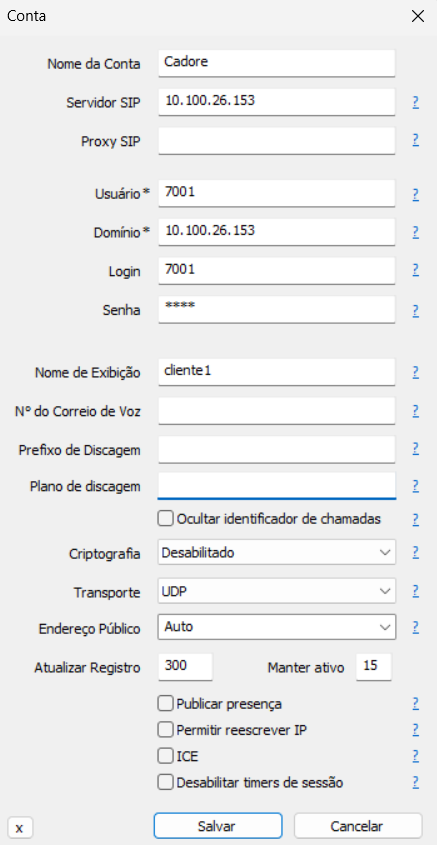
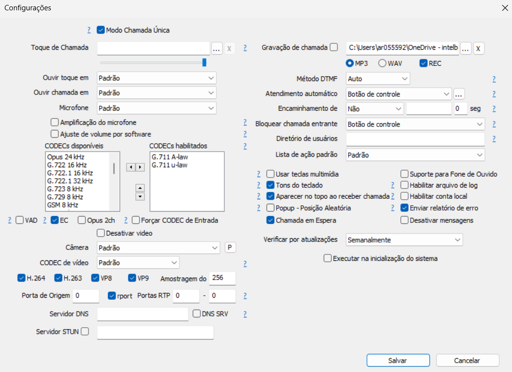
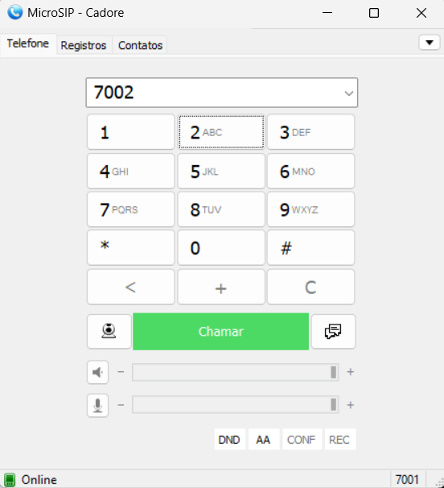

# Asterisk Appliance with Docker

### This repository implements Asterisk VOIP server with a default client configuration for sip phone calls.

Prerequisites
Before you begin, ensure you have the following packages installed on your system:

- Git version 2.34.1
- Docker version 24.0.6, build ed223bc
- Docker Compose version v2.21.0
- MicroSIP version 3.21.4 (SIP client)

---
### Getting Started:

First, copy the line below and paste on your prompt to clone the repository:

```
git clone https://github.com/arthurcadore/asterisk-appliance
```
If you don't have installed the package Git yet, do it before try to clone the respository!

Navigate to the project directory:

```
cd ./asterisk-appliance
```

If you don't have Docker (and Docker-compose) installed on your system yet, it can be installed by run the following commands (Script for Ubuntu 22.04): 

```
./installDocker.sh
```

### Start Application's Container: 
Run the command below to start docker-compose file: 

```
docker compose up & 
```
The "&" character creates a process id for the command inputed in, with means that the container will not stop when you close the terminal. 

---
### Access Application:

Once the container is up and running, you can access the container by `sip://127.0.0.1:5060`. 

To connect to the asterisk server, you can use the MicroSIP client, using the configuration as follows:

#### Server Parameters: 

<p align="center">
  
</p>


#### Data Parameters: 

<p align="center">
  
</p>


#### MicroSIP Interface:

Once the configuration was finished, you can see the MicroSIP interface as follows, look at the bottom right corner, the status of the connection should be "Connected".

<p align="center">
  
</p>


Also in the server logs you can see the connection established:

```
asteriskserver  | Asterisk Ready.
asteriskserver  | 2024-07-26 01:49:24,548 CRIT uncaptured python exception, closing channel <POutputDispatcher at 140516037849152 for <Subprocess at 140516037844400 with name asterisk in state STARTING> (stdout)> (<class 'OSError'>:[Errno 29] Illegal seek [/usr/lib/python3/dist-packages/supervisor/supervisord.py|runforever|220] [/usr/lib/python3/dist-packages/supervisor/dispatchers.py|handle_read_event|270] [/usr/lib/python3/dist-packages/supervisor/dispatchers.py|record_output|204] [/usr/lib/python3/dist-packages/supervisor/dispatchers.py|_log|173] [/usr/lib/python3/dist-packages/supervisor/loggers.py|info|327] [/usr/lib/python3/dist-packages/supervisor/loggers.py|log|345] [/usr/lib/python3/dist-packages/supervisor/loggers.py|emit|227] [/usr/lib/python3/dist-packages/supervisor/loggers.py|doRollover|264])
asteriskserver  | 2024-07-26 01:49:26,550 INFO success: asterisk entered RUNNING state, process has stayed up for > than 2 seconds (startsecs)
asteriskserver  | [Jul 26 01:49:36] ERROR[66][C-00000001]: netsock2.c:303 ast_sockaddr_resolve: getaddrinfo("dhcpserver", "(null)", ...): Temporary failure in name resolution
asteriskserver  | [Jul 26 01:49:36] WARNING[66][C-00000001]: acl.c:890 resolve_first: Unable to lookup 'dhcpserver'
asteriskserver  | 2024-07-26 01:49:36,226 CRIT uncaptured python exception, closing channel <POutputDispatcher at 140516037849152 for <Subprocess at 140516037844400 with name asterisk in state RUNNING> (stdout)> (<class 'OSError'>:[Errno 29] Illegal seek [/usr/lib/python3/dist-packages/supervisor/supervisord.py|runforever|220] [/usr/lib/python3/dist-packages/supervisor/dispatchers.py|handle_read_event|270] [/usr/lib/python3/dist-packages/supervisor/dispatchers.py|record_output|204] [/usr/lib/python3/dist-packages/supervisor/dispatchers.py|_log|173] [/usr/lib/python3/dist-packages/supervisor/loggers.py|info|327] [/usr/lib/python3/dist-packages/supervisor/loggers.py|log|345] [/usr/lib/python3/dist-packages/supervisor/loggers.py|emit|227] [/usr/lib/python3/dist-packages/supervisor/loggers.py|doRollover|264])
asteriskserver  | [Jul 26 01:49:36] WARNING[85][C-00000001]: app_dial.c:2663 dial_exec_full: Unable to create channel of type 'SIP' (cause 20 - Subscriber absent)
asteriskserver  | 2024-07-26 01:49:36,236 CRIT uncaptured python exception, closing channel <POutputDispatcher at 140516037849152 for <Subprocess at 140516037844400 with name asterisk in state RUNNING> (stdout)> (<class 'OSError'>:[Errno 29] Illegal seek [/usr/lib/python3/dist-packages/supervisor/supervisord.py|runforever|220] [/usr/lib/python3/dist-packages/supervisor/dispatchers.py|handle_read_event|270] [/usr/lib/python3/dist-packages/supervisor/dispatchers.py|record_output|204] [/usr/lib/python3/dist-packages/supervisor/dispatchers.py|_log|173] [/usr/lib/python3/dist-packages/supervisor/loggers.py|info|327] [/usr/lib/python3/dist-packages/supervisor/loggers.py|log|345] [/usr/lib/python3/dist-packages/supervisor/loggers.py|emit|227] [/usr/lib/python3/dist-packages/supervisor/loggers.py|doRollover|264])
asteriskserver  | [Jul 26 01:49:36] NOTICE[85][C-00000001]: translate.c:603 ast_translate: 24478 lost frame(s) 24479/0 (gsm@8000)->(slin@8000)->(ulaw@8000)
asteriskserver  | 2024-07-26 01:49:36,531 CRIT uncaptured python exception, closing channel <POutputDispatcher at 140516037849152 for <Subprocess at 140516037844400 with name asterisk in state RUNNING> (stdout)> (<class 'OSError'>:[Errno 29] Illegal seek [/usr/lib/python3/dist-packages/supervisor/supervisord.py|runforever|220] [/usr/lib/python3/dist-packages/supervisor/dispatchers.py|handle_read_event|270] [/usr/lib/python3/dist-packages/supervisor/dispatchers.py|record_output|204] [/usr/lib/python3/dist-packages/supervisor/dispatchers.py|_log|173] [/usr/lib/python3/dist-packages/supervisor/loggers.py|info|327] [/usr/lib/python3/dist-packages/supervisor/loggers.py|log|345] [/usr/lib/python3/dist-packages/supervisor/loggers.py|emit|227] [/usr/lib/python3/dist-packages/supervisor/loggers.py|doRollover|264])
asteriskserver  | [Jul 26 01:49:38] NOTICE[85][C-00000001]: translate.c:603 ast_translate: 24585 lost frame(s) 24586/0 (gsm@8000)->(slin@8000)->(ulaw@8000)
asteriskserver  | [Jul 26 01:49:38] NOTICE[85][C-00000001]: translate.c:603 ast_translate: 24585 lost frame(s) 24586/0 (gsm@8000)->(slin@8000)->(ulaw@8000)
asteriskserver  | 2024-07-26 01:49:38,678 CRIT uncaptured python exception, closing channel <POutputDispatcher at 140516037849152 for <Subprocess at 140516037844400 with name asterisk in state RUNNING> (stdout)> (<class 'OSError'>:[Errno 29] Illegal seek [/usr/lib/python3/dist-packages/supervisor/supervisord.py|runforever|220] [/usr/lib/python3/dist-packages/supervisor/dispatchers.py|handle_read_event|270] [/usr/lib/python3/dist-packages/supervisor/dispatchers.py|record_output|204] [/usr/lib/python3/dist-packages/supervisor/dispatchers.py|_log|173] [/usr/lib/python3/dist-packages/supervisor/loggers.py|info|327] [/usr/lib/python3/dist-packages/supervisor/loggers.py|log|345] [/usr/lib/python3/dist-packages/supervisor/loggers.py|emit|227] [/usr/lib/python3/dist-packages/supervisor/loggers.py|doRollover|264])
```
--- 
### Stop Container: 
To stop the running container, use the following command:

```
docker-compose down
```

This command stops and removes the containers, networks, defined in the docker-compose.yml file.
